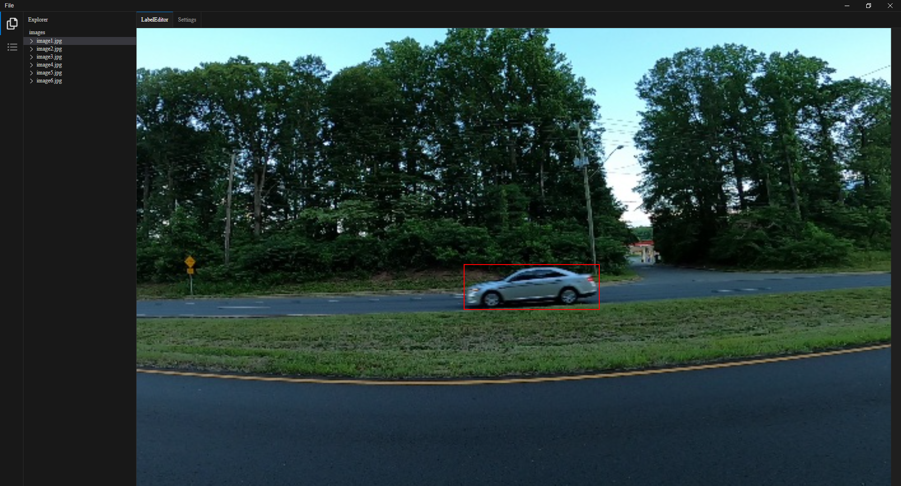

# Labelix

Labelix is a labeling tool for creating Yolo datasets. At the moment it's only tested on Windows 10, where there is a installer available for the latest version. It's built on top of Electron, that s why you can run it also on Linux and MacOS by cloning the repo and installing the npm dependecies.

## Tutorial
1. Download the latest installer exe from the releases page
2. Install the app
3. Open the folder where your images are located
4. Create label classes
5. Start labeling your images

## Features
* zoom and move images
* choose a color theme from vs code

## ToDo
* more settings to configure (e.g keyboard shortcuts, auto save, ...)
* save label boxes in a different path then input images
* remote projects for teams
